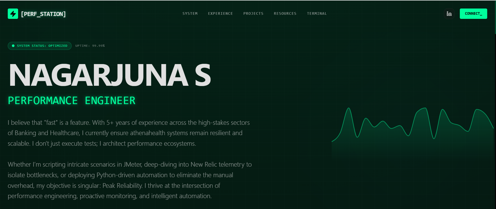

# ⚡ Nagarjuna S
**Performance Engineer**

---

## 🚀 About Me

I believe that **"fast" is a feature**. With 5+ years of experience across the high-stakes sectors of Banking and Healthcare, I currently ensure **Athenahealth** systems remain resilient and scalable. I don't just execute tests; I architect performance ecosystems.

Whether I'm scripting intricate scenarios in JMeter, deep-diving into New Relic telemetry to isolate bottlenecks, or deploying Python-driven automation to eliminate manual overhead, my objective is singular: **Peak Reliability**. I thrive at the intersection of performance engineering, proactive monitoring, and intelligent automation.

---

## 💼 Professional Experience

### **Athenahealth** | *MTS-Performance Engineer* (Present)
Specializing in test planning, advanced scripting, and bottleneck analysis to ensure systems deliver peak reliability and scalability in the Healthcare domain.

### **Tata Consultancy Services** | *IT Analyst* (2023 - 2024)
Leading performance engineering initiatives, optimizing client/server and web-based applications for high availability and scalability.

### **Wipro Limited** | *Senior Associate* (2020 - 2023)
Executed end-to-end performance testing, developed JMeter scripts, and collaborated with DBAs to resolve system bottlenecks.

---

## 🛠️ Technical Arsenal

### 🔬 Performance Testing
**Apache JMeter**, **HP LoadRunner**
*Designing and executing high-concurrency load, stress, and endurance tests.*

### ⚡ Automation & Scripting
**Python**, **Bash**, **PowerShell**, **Pywinauto**, **Java**
*Building custom utilities to eliminate manual effort and accelerate analysis.*

### 📊 Monitoring & APM
**New Relic**, **Zabbix**, **JProfiler**
*Deep-dive bottleneck analysis and real-time system telemetry.*

### ☁️ Infrastructure & Data
**AWS**, **Kubernetes**, **Docker**, **Linux**, **Oracle SQL**
*Navigating complex distributed systems and analyzing database performance.*

---

## 💻 Featured Projects & Automation

### 1. JTL Converter
A custom Python automation utility designed to help performance engineers in their day-to-day activities by converting and analyzing JMeter JTL files efficiently.
* **Tech:** Python, Automation, JMeter, Data Processing
* **Demo:** [JTL Converter on Render](https://jtl-converter.onrender.com/) | **Source:** [GitHub](https://github.com/nagarjunx/jtl_converter)

### 2. Personal Finance Management (PFM) Load Testing
Led performance testing for Yodlee Retail Banking Solutions, securely aggregating data from 14,000+ sources. Created test plans, reviewed complex SQL queries, and generated performance scorecards using **JMeter** and **Zabbix**.

### 3. Enterprise Load Simulation Framework
Developed robust scripts in Apache JMeter and LoadRunner to emulate realistic user behavior for high-concurrency load, stress, and endurance testing across enterprise applications.

---

<i>Driven by Data. Focused on Reliability. Crafted with Automation.</i>

